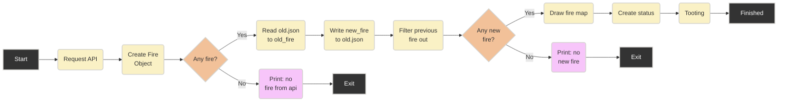

# california_fire


Mastodon: https://mastodon.world/@california_fire

### Main
```
main.py
```

### Tests
```
python -m unittest discover
```

### Flowchart 

```mermaid


flowchart LR
    A1[Start] --> A2(Request API)
    style A1 fill:#333,stroke:#d4d3cf,color:#fff,stroke-width:2px
    style A2 fill:#faf1c5,stroke:#d4d3cf,color:#333,stroke-width:2px

    A2 --> A3("Create Fire 
    Object")
    style A3 fill:#faf1c5,stroke:#d4d3cf,color:#333,stroke-width:2px

    A3 --> A4{Any fire?}
    style A4 fill:#f2c199,stroke:#d4d3cf,color:#333,stroke-width:2px


    A4 --> |Yes| A5("Read old.json 
    to old_fire")
    style A5 fill:#faf1c5,stroke:#d4d3cf,color:#333,stroke-width:2px

    A5 --> A7("Write new_fire 
    to old.json")
    style A7 fill:#faf1c5,stroke:#d4d3cf,color:#333,stroke-width:2px

    A7 --> A8("Filter previous 
    fire out")
    style A8 fill:#faf1c5,stroke:#d4d3cf,color:#333,stroke-width:2px

    A4 --> |No| A6("Print: no 
    fire from api")
    style A6 fill:#f7c5fa,stroke:#d4d3cf,color:#333,stroke-width:2px

    A6 --> A66[Exit] 
    style A66 fill:#333,stroke:#d4d3cf,color:#fff,stroke-width:2px

    A8 --> A9{"Any new 
    fire?"}
    style A9 fill:#f2c199,stroke:#d4d3cf,color:#333,stroke-width:2px

    A9 --> |Yes| A10("Draw fire map")
    style A10 fill:#faf1c5,stroke:#d4d3cf,color:#333,stroke-width:2px

    A10 --> A12("Create status")
    style A12 fill:#faf1c5,stroke:#d4d3cf,color:#333,stroke-width:2px

    A12 --> A13(Tooting)
    style A13 fill:#faf1c5,stroke:#d4d3cf,color:#333,stroke-width:2px

    A13 --> A14[Finished]
    style A14 fill:#333,stroke:#d4d3cf,color:#fff,stroke-width:2px

    A9 --> |No| A11("Print: no 
    new fire")
    style A11 fill:#f7c5fa,stroke:#d4d3cf,color:#333,stroke-width:2px

    A11 --> A111[Exit]
    style A111 fill:#333,stroke:#d4d3cf,color:#fff,stroke-width:2px


```
